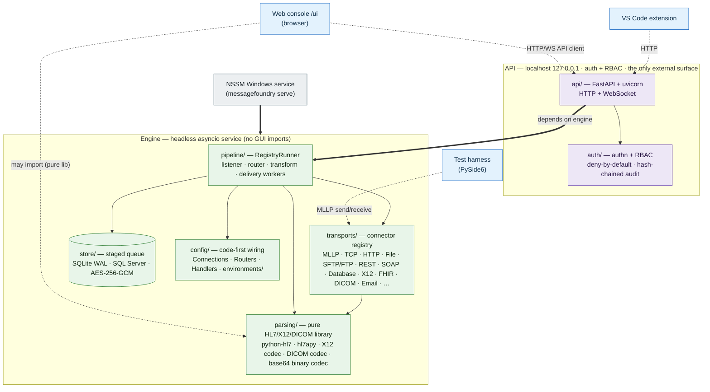
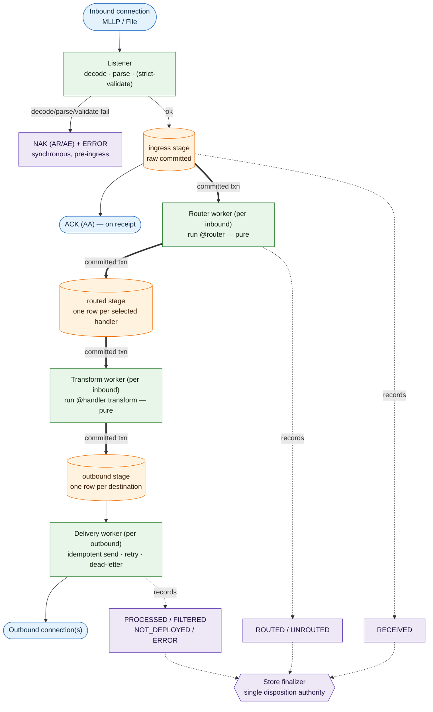
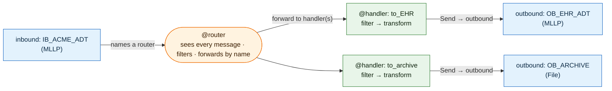

# Architecture

## Architectural standard: modular, contract-bounded components

MessageFoundry uses independent components with defined interfaces. Each component hides its internal design, so teams can work in parallel and limit conflicts. This standard guides the topology, store, and module map below.

**Modular design (component-based architecture).** The independent components are the headless **engine**, **configuration**, **web console** (`/ui`), **IDE extension**, **PySide6 test harness**, and **CLI tools**. Configuration contains Connections, Routers, Handlers, and environment values. The CLI includes `generate`, `check`, and `dryrun`, in addition to `serve`.

NSSM runs the Windows service, and CI checks changes. Engine packages are `config`, `parsing`, `store`, `transports`, `pipeline`, `auth`, and `api`. These boundaries limit the code that each change or AI context must include.

**Information hiding (Parnas).** David Parnas described this principle in his 1972 paper *"On the Criteria To Be Used in Decomposing Systems into Modules."* Each module hides a design decision behind an interface. Teams can then work on separate modules, and internal changes need not affect other components.

**Separation of concerns: high cohesion and loose coupling.**

- **High cohesion** keeps one concern inside one component, such as message processing in the engine or the interface in the web console.
- **Loose coupling** limits dependencies to defined interfaces. A change in one component then affects fewer other components.
- Smaller shared interfaces reduce conflicts between teams that work at the same time.

**Contract-first / interface-driven design.** Define each interface before building the components on either side. Each team then implements its component independently. In this repo:
- the **HTTP/WebSocket API** ([`api/app.py`](../messagefoundry/api/app.py)) connects the engine and its clients (web console, IDE, harness).
- the **connector registry** ([`transports/base.py`](../messagefoundry/transports/base.py)) defines the interface for pluggable transports.
- the **one-way dependency rule** keeps `pipeline` / `transports` / `parsing` / `store` / `config` from importing `api`.

**Team organization.**

- **Conway’s Law** describes how system structure can reflect communication between teams. The **Inverse Conway Maneuver** defines component boundaries to support the intended division of work. See [WORKTREES.md](WORKTREES.md).
- Each component has one owner at a time. Domain-driven design calls this a **bounded context**. Concurrent sessions keep changes in their own module and branch.

## Topology: engine-as-library + localhost API

The engine is an importable Python package (`messagefoundry`). Clients — primarily the
**browser web console** (`/ui`, `messagefoundry_webconsole`) — drive it over a localhost HTTP +
WebSocket API (FastAPI/uvicorn). The same API serves three deployments without code changes:

- **Embedded** — another Python program owns the engine in-process via `create_app(engine)`
  (the async test client, embedding). A UI client runs in a separate process or browser. It uses only the HTTP API and never imports the engine.
- **Local daemon** — engine runs as a Windows service / Linux daemon. The web console attaches over
  the API. See [SERVICE.md](SERVICE.md) for the Windows service setup (NSSM).
- **Remote** — the same API over the network. Remote access is supported and **off by default**. Set `[security].local_access_only = false`. Set the bind address in `[security].listen_address`.
  Configure in-process TLS through `[api].tls_cert_file`, or use a declared trusted proxy. The proxy settings are `[api].tls_terminated_upstream` and `[api].trusted_proxies`. Auth is always required,
  and an off-loopback plaintext bind is refused at startup.

The library API defines the logical boundary. Deployment determines whether components share a process or communicate across processes.

The diagram shows separate clients connected through the API. Engine packages never import `api`:



## The message store *is* the queue

The store uses a transactional **staged queue** on SQLite in WAL mode. One generic `queue` table has a `stage` discriminator: `ingress`, `routed`, or `outbound`. **Step B** separates routing from transformation (ADR 0001 — [docs/adr/0001-staged-pipeline-architecture.md](adr/0001-staged-pipeline-architecture.md)):

```
inbound msg ─▶ decode / parse / (strict-validate)   [synchronous — still NAK on failure]
                    │
                    ▼ persist raw to the INGRESS stage  ─▶ commit ─▶ ACK source   [ACK-on-receipt]
                    │   (ingress + routed lanes key on channel_id; outbound on destination_name)
                    ▼ router worker (per inbound): run Router
              produce one ROUTED row per selected handler + complete the ingress row   (one txn)
                    │
                    ▼ transform worker (per inbound): run that handler's transform
              produce an OUTBOUND row per destination + complete the routed row   (one txn)
                    │
                    ▼ per-destination delivery worker
              deliver ─▶ mark done | mark failed+reschedule (retry policy)
```

The engine sends an **ACK on receipt**, after it commits the raw message to the ingress stage. Routing, transformation, and delivery follow that commit. A slow Router, transform, or outbound therefore does not stop intake.

Each stage handoff uses one committed transaction: claim the row, produce the next-stage rows, and complete the current row. A crash before commit rolls back the transaction for another attempt. Each handoff is idempotent, and `reset_stale_inflight` recovers in-flight rows from **every** stage at startup.

The queue supports **at-least-once delivery**, **retries**, and **replay** without a separate broker. **Routers and transforms must be pure** so another attempt produces the same output. **Outbound connections must be idempotent**. The store preserves correlation IDs for duplicate detection. Each destination drains independently, and a slow transform does not stop routing.

The **store finalizer** sets the final message disposition. It records `RECEIVED` at ingress and `ROUTED` or `UNROUTED` after the Router. When no work remains in flight, it selects:

- `PROCESSED`: all delivery work completed.
- `FILTERED`: every Handler ran but delivered nothing.
- `NOT_DEPLOYED`: all addressed destinations are in the graph with `deployed=false`.
- `ERROR`: a stage sent the message to the dead-letter path.

The finalizer waits while an earlier-stage row remains pending. One completed Handler cannot finalize a message while another Handler still awaits transformation.

The ACK confirms receipt and persistence only. Post-ACK routing or transform failures produce logs, dead-letter records, and AlertSink notifications. They do not send a NAK to the source.

`NOT_DEPLOYED` (BACKLOG #233, [ADR 0111](adr/0111-not-deployed-connections.md)) requires a separate event record. The finalizer selects `FILTERED` when no queue rows remain and the message is still `ROUTED`. Without that record, a declined destination would appear as a filtered message.

Before an outbound-stage row is created, the transform worker declines each `Send` to an outbound with `deployed=false`. It writes one `not_deployed` `message_events` row per declined destination in the same `MessageStore.transform_handoff` transaction.

If no deliveries occur, that event produces `NOT_DEPLOYED`. Without the event, the result is `FILTERED`. If a deployed sibling delivers, the result is `PROCESSED`, and the event still records the skipped destination. The `message_events` verbosity setting cannot remove this event because the final disposition requires it.

Dry-run and the Test Bench do not run the finalizer. They therefore show a fully declined message as `FILTERED`. Declined names remain in `RouteOutcome.declined` and do not pass into `DryRunResult`.

The router/transform split was taken after Step A's measured write amplification (now ~3 durable
transactions/message for a single-handler message, +1 per extra handler) — recorded in
[docs/benchmarks/step-b-write-amplification.md](benchmarks/step-b-write-amplification.md). An optional
per-inbound `ack_after=delivered` (defer the ACK until delivery succeeds) is planned but not built —
the pipeline is ACK-on-receipt only.

The same staged flow as a rendered diagram:



## Concurrency

The asyncio runtime has one listener, Router worker, and transform worker per **inbound connection**. Each **outbound connection** has one delivery worker. `RegistryRunner` supervises listeners, file/database pollers, Router/transform workers, and retry timers.

It restarts a worker after a crash. Router and transform workers continue with acknowledged messages when the source stops. Each worker class has its own wake event. A producer wakes only its downstream consumer, which prevents cross-class lost wakeups.

**Startup wiring** also isolates connection failures (ADR 0031). Failures include an unresolved `env()` value or certificate, an egress refusal, an occupied port, or refused cleartext exposure. The engine records the connection as `failed`, logs the failure, and sends an alert. It starts the remaining graph and serves the API.

A failed outbound still has a delivery worker. The worker retries queued messages, and a successful reload or restart restores the connection. A failed inbound does not listen. Reload remains fail-fast: it uses `build_check` on the whole new registry before it stops a healthy graph. Only startup permits partial operation.

## Parsing: tolerant-first, strict-on-demand

- **`python-hl7`** parses tolerantly and powers field *peek* for routing. Hot path.
- **`hl7apy`** does version-aware + profile validation, opt-in per inbound connection
  (`validation.strict`). Slower. Kept off the routing hot path.

Real-world HL7 v2 is frequently non-conformant. Strict-by-default would drop messages
that must still route, so tolerance is the default and strictness is an opt-in.

## Configuration: connections + code-first routing

The target model is a **graph wired by name, authored as Python** — no enclosing "channel"
object:

- a **Connection** is a named inbound or outbound endpoint (MLLP, file, …).
- an inbound Connection names a **Router** — a Python script that sees each received message. It selects **Handlers** or filters the message.
- a **Handler** is a Python script that filters → transforms → sends to outbound Connection(s).

Configuration is version-controlled Python. The database stores runtime state and messages **only**, never configuration.

Connections/Routers/Handlers are authored against the `messagefoundry` surface
(`inbound`/`outbound`/`@router`/`@handler`/`Send`/`MLLP`/`File`/`Message`). A directory of such
modules loads via `load_config` into a `Registry` that the engine's `RegistryRunner` runs.

The configuration graph wired by name (no enclosing "channel" object) as a rendered diagram:



## PHI / security

Messages contain PHI. Access control and the *data* protections are tracked separately — see
[SECURITY.md](SECURITY.md) (identity, RBAC, action audit) and [PHI.md](PHI.md) (data-at-rest,
transport, logging, retention, de-identification), which is the authoritative built-vs-planned map.
The per-interface trust boundaries and STRIDE threats are in
the internal security/THREAT-MODEL.md (PW.1–2 / ASVS V15).
[SECURITY-DOCS-POLICY.md](SECURITY-DOCS-POLICY.md) explains withheld material and access requests.

**Built controls** include authentication, role-based access, and a hash-chained, append-only audit log. PHI views require `messages:view_raw` or `messages:view_summary`. Audit records identify users who view, search, or replay messages.

When a key is set, the store cipher encrypts message bodies with AES-256-GCM. Owner-only database/WAL file permissions and required volume encryption protect the remaining stored data.

**Additional controls** are documented in [PHI.md](PHI.md). PHI redaction uses standard-library `logging`, not structlog. An always-on handler filter and `safe_exc()` remove HL7-shaped content from logged exceptions and stored dispositions.

Per-connection MLLP-over-TLS supports TLS 1.2+, server-certificate verification, hostname checks, and optional mTLS. Startup rejects off-loopback plaintext listeners. The async `RetentionRunner` enforces retention and purge rules.

## Module map

| Package / module | Responsibility |
|---|---|
| `messagefoundry.config` | Connector models (`models.py`) + code-first wiring registry/loader (`wiring.py`) + service settings (`settings.py`) |
| `messagefoundry.parsing` | Tolerant peek (python-hl7) + strict validate (hl7apy). Parse tree (`tree.py`) and the `Message` transform model (`message.py`). Pure non-HL7 codecs — X12 EDI (`x12/`), DICOM headers/SR over pydicom (`dicom/`, ADR 0025), and the base64 binary-carriage codec (`binary.py`, ADR 0028) |
| `messagefoundry.store` | Durable message store / **staged queue** (one `queue` table, `stage` = ingress\|routed\|outbound), SQLite WAL. Every receipt logged with a disposition that flows with the message. `Store` protocol + `open_store` factory in `base.py`. Production server-DB backends in `postgres.py` and `sqlserver.py` |
| `messagefoundry.transports` | Inbound & outbound connections (MLLP, file, X12 raw-TCP, DICOM C-STORE SCP inbound over pynetdicom — ADR 0025, …), resolved through a registry (`base.py`) — never special-cased in `pipeline/` |
| `messagefoundry.anon` | Deterministic, secret-per-dataset pseudonymization / de-identification (fail-closed, ADR 0030) — exposed to the tee (`anonymize-captures`) and the test harness |
| `messagefoundry.pipeline` | Per-message routing/handling (`RegistryRunner` in `wiring_runner.py`) + per-inbound-connection supervision (`engine.py`). Offline `dryrun.py` |
| `messagefoundry.api` | Localhost FastAPI surface (`app.py` + response `models.py`) — the engine's only external interface. The `/ui` browser web console mounts onto this app from a separate wheel (see below) via `mount_ui`, pinned against the `api/_ui_seam.py` contract ([WEBCONSOLE-PACKAGE.md](WEBCONSOLE-PACKAGE.md)) |
| `messagefoundry.apiclient` | Qt-free / FastAPI-free engine-client library (ADR 0088) — a small typed httpx wrapper over the API, shared by the test harness and any future client |
| `messagefoundry.auth` | Authn + RBAC core (no FastAPI): permissions/roles, `Identity`, password hashing, opaque session tokens, LDAP/Kerberos (`service.py`) — enforced by `api` |
| `messagefoundry.generators` | Conformant synthetic HL7 generators (ADT, ORM, ORU, …) behind `messagefoundry generate` |
| `messagefoundry.service` | Local Windows service control (`messagefoundry service {install,start,stop,status}`. ADR 0088), wrapping the NSSM scripts |
| `__main__.py`, `checks.py` | CLI entrypoint (`serve` / `generate` / `check` / `service`) + the `check` commit/CI gate |

Dependency direction is one-way: `pipeline` / `transports` / `parsing` / `store` / `config`
never import `api`. The API depends on the engine. The clients (web console, harness) depend on the API
(via `apiclient`). The former PySide6 desktop console (`messagefoundry.console`) was retired — its
reusable Qt widgets moved to the harness (BACKLOG #103, ADR 0032 retired).

**Separate components outside `messagefoundry.*`:**

- Operator configuration: `--config` modules and [`environments/`](../environments/) overrides.
- Web console: [`messagefoundry_webconsole/`](../messagefoundry_webconsole/), in the separately versioned `messagefoundry-webconsole` wheel. It mounts same-origin under `/ui` (ADR 0065, [WEBCONSOLE-PACKAGE.md](WEBCONSOLE-PACKAGE.md)).
- IDE extension: [`ide/`](../ide/).
- Test harness: [`harness/`](../harness/).
- Sample configuration and messages: [`samples/`](../samples/).
- Windows service scripts: [`scripts/service/`](../scripts/service/).
- CI and supply-chain workflows: [`.github/workflows/`](../.github/workflows/).

## Dependencies

Declared in [`pyproject.toml`](../pyproject.toml) (the source of truth) as `>=` minimums. The pinned,
hashed resolution lives in the committed **`uv.lock`** / **`requirements.lock`** (DEP-1, see
[SECURITY.md](SECURITY.md#dependency-lockfile-dep-1)). Requires **Python 3.14+**.

**Runtime**

- `hl7` (python-hl7) — fast, tolerant parsing for the routing hot path
- `hl7apy` — version-aware validation + profiles (opt-in strict path)
- `pydantic` — config / connector models and validation
- `aiosqlite` — async SQLite for the message store / queue
- `fastapi` + `uvicorn[standard]` — localhost engine API
- `argon2-cffi` — argon2id password hashing
- `cryptography` — AES-256-GCM at-rest encryption for the store
- `ldap3` + `pyspnego` — Active Directory / LDAP auth and Windows SSO (Kerberos)

**Optional extras**

- `harness` → `PySide6` only (LGPL — chosen so the OSS test harness GUI is distributable, not PyQt). The harness is the sole PySide6 consumer (was `[console]` before the desktop console was retired — BACKLOG #103. Its HTTP client, `httpx` + `truststore`, is now a base runtime dependency rather than part of this extra)
- `sqlserver` → `aioodbc` (production SQL Server store, also needs the OS-level Microsoft ODBC
  Driver 18 for SQL Server, which is not pip-installable, lazy-imported so SQLite-only installs skip it)
- `dicom` → `pydicom` + `pynetdicom` (DICOM codec — headers/SR only, no numpy — and the C-STORE SCP
  inbound connector, ADR 0025, lazy-imported so non-DICOM installs skip it)
- `dev` → `pytest` (with the `asyncio`, `timeout` and `rerunfailures` plugins), `ruff`, `mypy` (`httpx`, the ASGI test client, is now a base dependency and is no longer declared here)

**Build / tooling** — `hatchling` (build backend), Ruff (format + lint, no Black), mypy (strict),
pytest.
